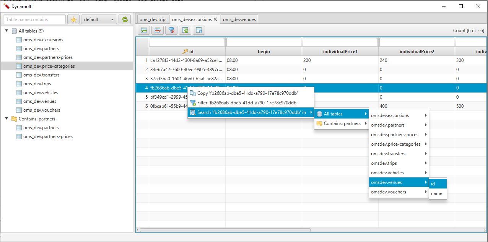
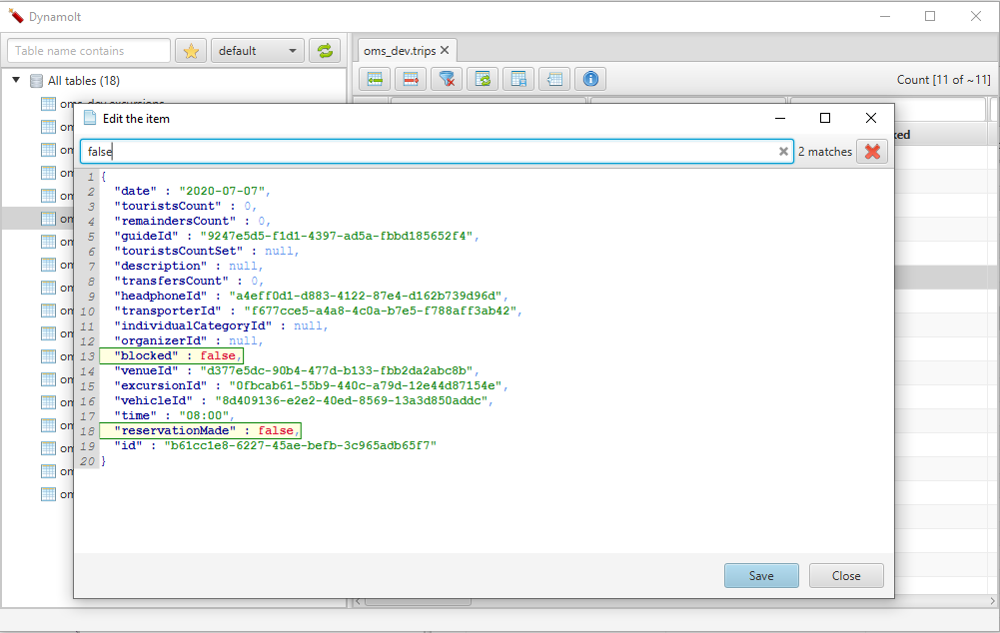

# DynamoIt
It's a simple DynamoDB graphical client written on JavaFX.

This client allows easily to view, edit, create, and delete data.

The main idea of the client is to reach the required data in a few clicks.

## Features
 * No login required. The client uses AWS cli profiles.
 * Group tables by keywords
 * Automatically detects when to use scan or query requests
 * Supports pagination to view data
 * Fast data filtering
 * Edit or delete the selected record 

## Screenshots:

