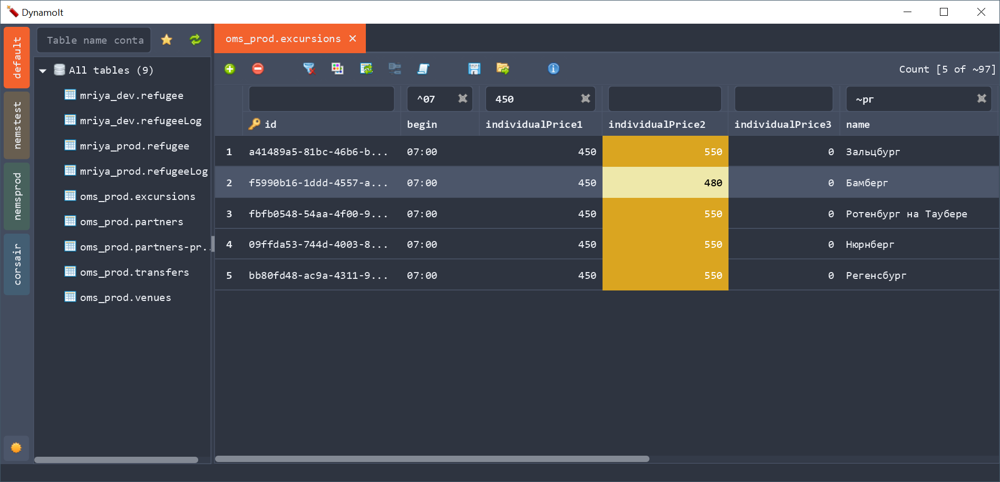

# DynamoIt
It's a simple DynamoDB graphical client written on JavaFX.

This client allows easily to view, edit, create, and delete data.

The main idea of the client is to reach the required data in a few clicks.

## Features
 * No login required. The client uses AWS cli profiles.
 * Highlights profiles with unique colors 
 * Group tables by keywords
 * Automatically detects when to use scan or query requests
 * Supports pagination to view the data.
 * Fast data filtering
 * Edit or delete the selected records
 * Import / Export data as json file 
 * Search (Ctrl+F) in the edit item dialog
 
## Supported filters
Examples are based on "hello world"

|Filter name|Example|
|-----------|:------|
|__EQUALS__ |hello world|
|__NOT_EQUALS__ |!=hello world|
|__BEGINS_WITH__|^hello|
|__CONTAINS__|~world|
|__NOT_CONTAINS__|!~something|
|__EXITS__|$| 
|__NOT_EXITS__|!$| 

## System requirements, building and running
At least Java 11 and maven to build and run the application.

Execute the next command to build
```
mvn clean package
```

A jar file with all dependencies will be created in the _target/fatJar_ directory.

To run the application simply execute the command
```
java -jar target/fatJar/DynamoIt-<version>.jar 
```

To build a portable bundle you need Java 15 and execute the next command
```
mvn clean package -Ppackage
```

## Screenshots:
The main screen


The main screen with filters


The edit item dialog

