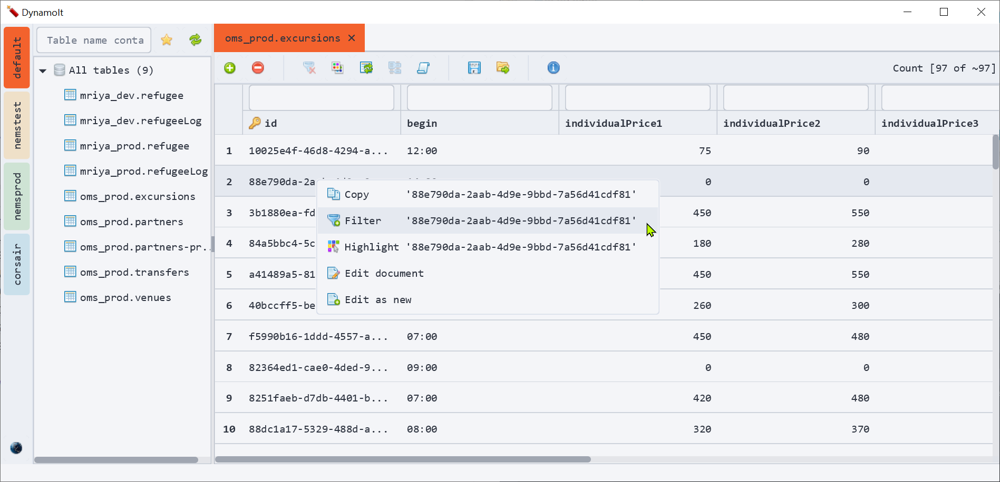
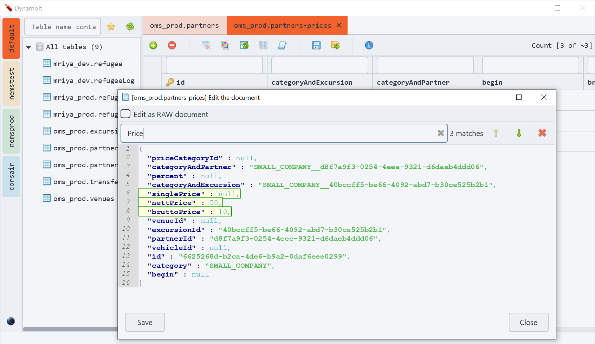
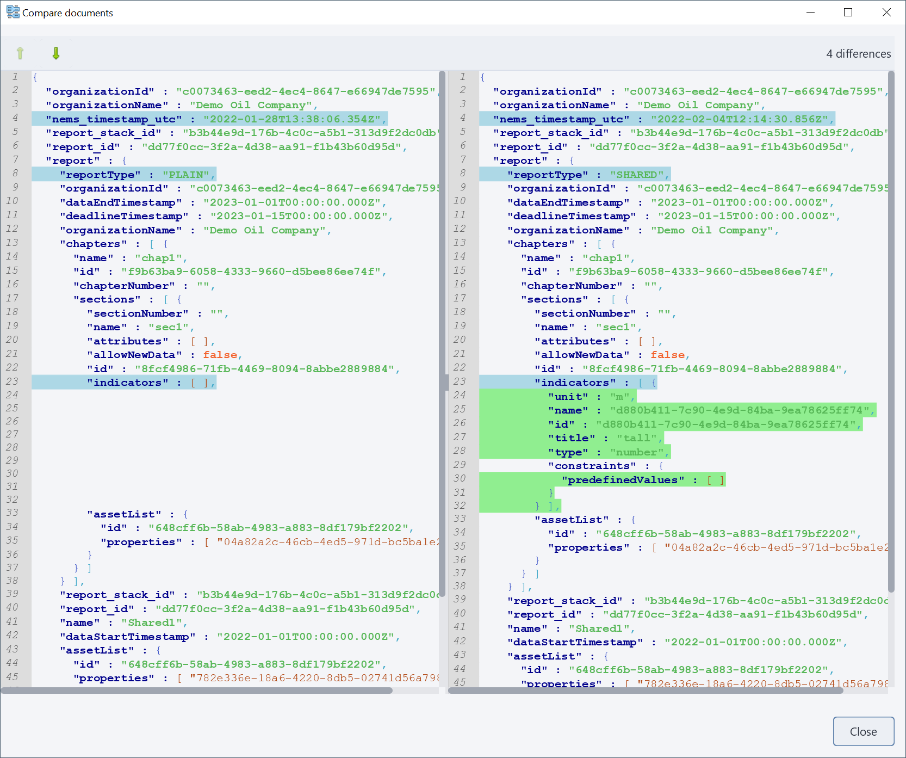

## Overview
It's a simple DynamoDB graphical client written on JavaFX.

This client allows easy viewing, editing, creating, and deleting of data.

The main idea of the client is to reach the required data in a few clicks without thinking a scan or query operation is required for that.

The client only requires properly configured settings for the AWS CLI tool. Read [the official AWS CLI documentation](https://docs.aws.amazon.com/cli/latest/userguide/cli-configure-quickstart.html) if it is not configured yet.
Or configure a new remote or local profile manually using the "Create a new profile" dialog.   

## Features
 * No login required. The client uses AWS CLI profiles.
 * Highlights profiles with unique colors 
 * Group tables by keywords
 * Automatically detects when to use scan or query requests
 * Supports pagination to view the data.
 * Fast data filtering
 * Highlighting values in the data table
 * Context menu to close all/others tabs
 * Open table in the AWS web console
 * Edit or delete the selected records
 * Import / Export data as json file 
 * Search (Ctrl+F) in the edit item dialog
 * Compare two selected documents
 * Light / Dark themes support
 * Change region for the active profile
 * Local DynamoDB support
 
## Supported filters
Examples are based on "hello world"

|Filter name|Example|
|-----------|:------|
|__EQUALS__ |hello world|
|__NOT_EQUALS__ |!=hello world|
|__BEGINS_WITH__|^hello|
|__CONTAINS__|~world|
|__NOT_CONTAINS__|!~something|
|__EXISTS__|$| 
|__NOT_EXISTS__|!$| 

## System requirements, building and running
At least Java 17 and maven to build and run the application.

Execute the next command to build
```
mvn clean package
```

A jar file with all dependencies will be created in the _target/fatJar_ directory.

To run the application simply execute the command
```
java -jar target/fatJar/DynamoIt-<version>.jar 
```

To build a portable bundle
```
mvn clean package -Ppackage
```

## Screenshots:
The main screen (Light theme)


The main screen with filters (Dark theme)


The edit item dialog


The compare dialog


A new profile dialog

